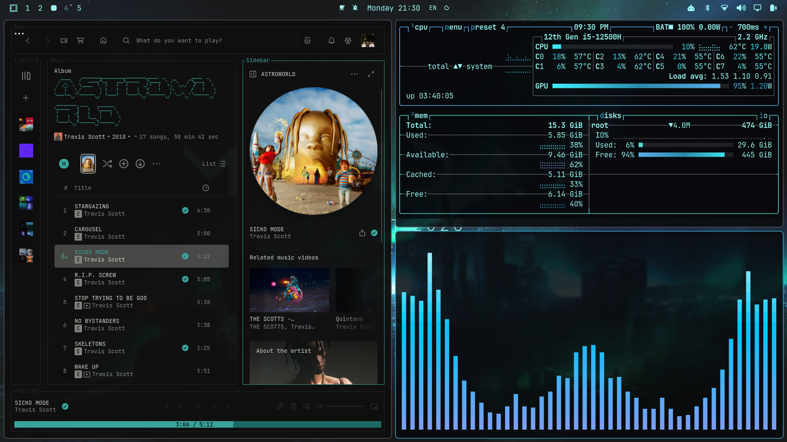

# dotfiles

My desktop setup, managed with [GNU Stow](https://www.gnu.org/software/stow/). This repo is
shared between my Omarchy laptop and my Mac: nvim, tmux and Ghostty are linked on both, and
everything else is Linux-only.



## The setup

- **OS:** [Arch Linux](https://archlinux.org/) with [Omarchy](https://omarchy.org/)
- **Window manager:** [Hyprland](https://hypr.land/) (Lua config, on top of Omarchy's defaults)
- **Terminal:** [Ghostty](https://ghostty.org/), colors from the current Omarchy theme, 85% opacity
- **Editor:** [Neovim](https://neovim.io/) 0.12 with the built-in `vim.pack`, colorscheme follows the Omarchy theme (carbonfox on macOS)
- **Multiplexer:** [tmux](https://github.com/tmux/tmux), layered over Omarchy's tmux keybinds on Linux
- **Music:** Spotify themed with [Spicetify](https://spicetify.app/) and its Marketplace
- **Also:** fastfetch, btop, cava, starship, voxtype, and `jarvis`, a Spotify + btop + cava dashboard

## What's in each folder

Each Stow package is laid out the way its files sit under `$HOME`.

| Folder | Links to | What it holds |
| --- | --- | --- |
| `nvim/` | `~/.config/nvim/` | Neovim config (`init.lua`) and the `vim.pack` lockfile |
| `tmux/` | `~/.tmux.conf` | tmux config; sources Omarchy's tmux config when Omarchy is installed |
| `ghostty/` | `~/.config/ghostty/` | Shared `config`, plus `macos.conf` and `linux.conf` (Omarchy theme, opacity) |
| `hypr/` | `~/.config/hypr/` | Hyprland overrides: monitors, input, bindings, look and feel, hybrid-GPU env |
| `fastfetch/` | `~/.config/fastfetch/` | fastfetch layout used by the shell intro |
| `btop/` | `~/.config/btop/` | `btop.conf`, plus `jarvis.conf` used by the dashboard |
| `cava/` | `~/.config/cava/` | cava config, shaders and color themes |
| `starship/` | `~/.config/starship.toml` | Prompt |
| `voxtype/` | `~/.config/voxtype/` | Voice-to-text settings (local Whisper) |
| `spicetify/` | `~/.config/spicetify/` | Spicetify config and the Marketplace app/theme |
| `bash/` | `~/.bashrc` | Omarchy's bash defaults, my aliases, and the fastfetch intro |
| `bin/` | `~/.local/bin/` | `jarvis`, which tiles Spotify, btop and cava on an empty workspace |
| `yazi/` | `~/.config/yazi/` | Yazi file manager theme (cyan `#00c8ff`, blue `#7aa2f7`). Linked on macOS too |
| `gtk/` | `~/.config/gtk-3.0/gtk.css`, `~/.config/gtk-4.0/gtk.css` | GTK3/GTK4/libadwaita colors on top of `adw-gtk3-dark` |
| `omarchy/` | `~/.config/omarchy/shell.toml` | Omarchy shell overrides (polkit password prompt colors) |
| `portal/` | `~/.config/xdg-desktop-portal/`, `~/.config/xdg-desktop-portal-termfilechooser/` | File open/save dialogs as yazi in Ghostty (AUR: `xdg-desktop-portal-termfilechooser`) |

These two aren't Stow packages. Don't `stow` them:

| Folder | What it holds |
| --- | --- |
| `system/` | Copies of root-owned files (keyboard backlight color, resume hook, GPU module setup), mirrored by path, plus `install.sh` to put them back with sudo |
| `packages/` | `pacman.txt` (official and Omarchy repo packages), `aur.txt` (AUR), plus `install.sh` |

What's in `system/`:

- `etc/udev/rules.d/91-kbd-color.rules`: sets the RGB keyboard backlight color at boot
- `usr/lib/systemd/system-sleep/kbd.sh`: restores the backlight brightness and color after resume
- `etc/modprobe.d/nvidia.conf`: `nvidia_drm modeset=1`
- `etc/mkinitcpio.conf.d/00-i915-first.conf`: loads i915 before nvidia so the Intel iGPU gets `renderD128`

## Setting up a fresh machine

### Omarchy (Linux)

1. Install Omarchy from <https://omarchy.org/> and boot into it.
2. Clone the repo:

   ```sh
   git clone https://github.com/NikhileshThiru/dotfiles.git ~/dotfiles
   cd ~/dotfiles
   ```

3. Install the packages. This also installs `stow`.

   ```sh
   ./packages/install.sh
   ```

4. Link the configs. Anything already there (for example, Omarchy's defaults) is moved to
   `<name>.bak.<timestamp>` first.

   ```sh
   ./install.sh
   ```

5. Put the system files back, then reboot. This rebuilds the initramfs for the GPU changes.

   ```sh
   ./system/install.sh
   ```

6. Spicetify: open Spotify once and log in, then:

   ```sh
   sudo chmod a+wr /opt/spotify
   sudo chmod -R a+wr /opt/spotify/Apps
   spicetify backup apply
   ```

   If it complains about the backup version (the `[Backup]` section of `config-xpui.ini` came
   from the old machine), run `spicetify restore backup apply`.

7. Open `nvim`. Plugins install at the revisions pinned in `nvim-pack-lock.json`, Treesitter
   parsers build, and the current Omarchy theme's colorscheme is cloned on first start. Install
   language servers and formatters from `:Mason`.

### macOS

```sh
brew install git stow neovim tmux ripgrep fzf tree-sitter-cli yazi
brew install --cask ghostty
git clone https://github.com/NikhileshThiru/dotfiles.git ~/dotfiles
cd ~/dotfiles
./install.sh
```

On macOS, `install.sh` only links nvim, tmux, yazi and Ghostty, and skips `linux.conf`. Neovim
0.12+ and tree-sitter CLI 0.26.1+ are required.

To link by hand instead of using `install.sh`:

```sh
stow nvim tmux yazi
stow --no-folding --ignore='linux\.conf' ghostty   # macOS
stow --no-folding --ignore='macos\.conf' ghostty   # Linux
stow hypr fastfetch btop cava starship voxtype spicetify bash   # Linux
stow --no-folding bin                                           # Linux
stow --no-folding gtk omarchy portal                            # Linux
gsettings set org.gnome.desktop.interface gtk-theme adw-gtk3-dark   # Linux
```

## Day to day

- Files under `~/.config/...` are symlinks into this repo, so edit them in place and commit
  from `~/dotfiles`.
- Changing the Omarchy theme (`omarchy theme set ...`) re-themes Ghostty, tmux, btop and
  running nvim sessions. Nothing in the repo changes.
- Plugin updates (`:lua vim.pack.update()`) rewrite `nvim-pack-lock.json`. Commit it so the
  other machine gets the same versions.
- Refresh the package lists after installing or removing packages:

  ```sh
  pacman -Qqen > packages/pacman.txt
  pacman -Qqem > packages/aur.txt
  ```

- If you change a file under `/etc` or `/usr/lib`, copy it into `system/` at the same path.
- To add another config, create a new package, e.g. `mkdir -p foo/.config && mv ~/.config/foo foo/.config/ && stow foo`
- To unlink a package: `stow -D <package>`

## macOS vs Linux

- **Ghostty:** OS-specific settings go in `macos.conf` or `linux.conf`, loaded with
  `config-file = ?macos.conf` / `?linux.conf`. `install.sh` only links the one for the
  current OS, and the `?` keeps Ghostty from complaining about the other.
- **tmux:** On Omarchy, `.tmux.conf` sources `/usr/share/omarchy/config/tmux/tmux.conf`, so
  Omarchy's keybinds (`C-Space` prefix, `Alt+Enter` splits, `Alt+1-9` windows) and themed status
  bar apply. `C-b` still works as a second prefix. My own settings are re-applied on top.
  macOS-only settings go in the `if-shell 'uname | grep -q Darwin'` block.
- **Neovim:** If `~/.local/state/omarchy/current/theme/neovim.lua` exists, its theme plugin is
  cloned into `~/.local/share/nvim/site/pack/omarchy-themes/` and applied. Otherwise the
  colorscheme is carbonfox. These theme plugins stay out of `vim.pack` so switching themes
  doesn't change the shared lockfile.
